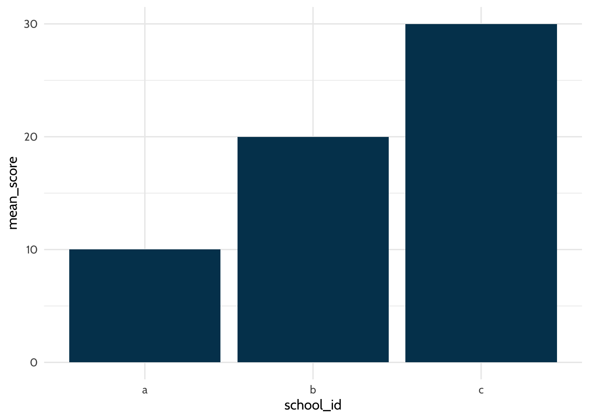
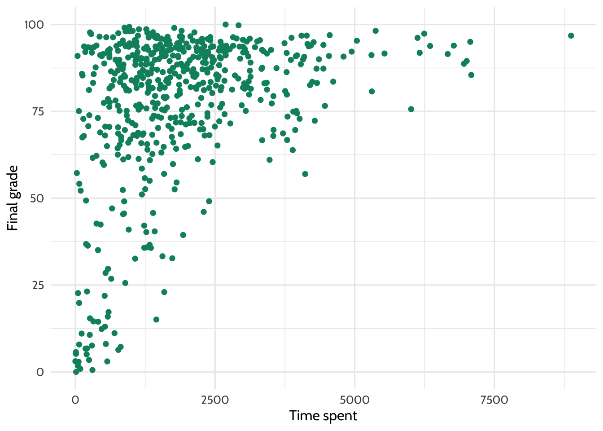

# Walkthrough 1: The education data science pipeline with online science class data {#c07}

## Introduction to the walkthroughs

This chapter is the first of eight walkthroughs, each exploring the *education data science pipeline* through different datasets. The pipeline includes common steps in data science projects, like cleaning, tidying, exploring, visualizing, and modeling data, as depicted by @r4ds2023.

<div class="figure" style="text-align: center">

<p class="caption">(\#fig:fig7-1)Data science cycle</p>
</div>

Using data from a number of sources, you will learn the end-to-end process of working with education datasets. While the walkthrough topics vary, their structure and section headings are consistent. Each walkthrough begins with a vocabulary section, followed by an introduction to the dataset and the central question or problem.

This chapter assumes familiarity with four core concepts that comprise the foundational skills framework: projects, functions, packages, and data. If you need a refresher about these, refer to the previous chapter, [Chapter 6](#c06).

## Topics emphasized

This chapter on the education data science pipeline emphasizes:

- Tidying data 
- Transforming data
- Visualizing data
- Modeling data

## Functions introduced

- `dplyr::rename()`
- `dplyr::mutate()`
- `dplyr::across()`
- `tibble::tibble()`
- `dplyr::case_when()`
- `tidyr::pivot_longer()` and `tidyr::pivot_wider()`
- `dplyr::group_by()`
- `mean()`
- `dplyr::summarize()` or `dplyr::summarise()`
- `tidyr::separate()`
- `stringr::str_sub()`
- `as.numeric()`
- `data.frame()`
- `dplyr::left_join()`, `dplyr::right_join()`, `dplyr::semi_join()`, and `dplyr::anti_join()`
- `dplyr::distinct()`
- `ggplot2::ggplot()`
- `ggplot2::geom()`
- `ggplot2::geom_bar()`
- `ggplot2::geom_point()`
- `ggplot2::geom_smooth()`
- `lm()`
- `summary()`
- `sjPlot::tab_model()`
- `apaTables::apa.reg.table()`
- `dplyr::filter()`
- `apaTables::apa.cor.table()`

## Vocabulary

In this walkthrough, you'll learn the following key terms: 

  - data frame
  - education data science pipeline
  - item
  - joins
  - keys
  - measure
  - log-trace data
  - passed arguments
  - reverse scale
  - regression
  - string variables
  - survey
  - tibble
  - tidy data
  - tidy selection

## Chapter overview

In this walkthrough, you will explore some of the key steps of many data science projects in education. In particular, you'll focus on how to tidy and transform data. These steps are sometimes referred to as "data wrangling" or "data manipulation". These tasks rely heavily on a set of tools you'll use in all of the walkthroughs. They are associated with the {tidyverse}, a set of packages for data manipulation, exploration, and visualization. 

The {tidyverse} follows the design philosophy of "tidy" data [@wickham2014]. Tidy data has a specific structure: each variable is a column, each observation is a row, and each type of observational unit is a table. We'll discuss the {tidyverse} and tidy data throughout the book. For more information, see the Foundational Skills chapters or <https://www.tidyverse.org/>.

## Background

Instructors developed the online science classes featured in this chapter through a statewide course provider created to supplement students’ local school enrollment. For example, students may have enrolled in an online physics class if their school did not offer one. The data were originally collected for a research study using multiple data sources to understand students' course-related motivation. These datasets include:

1.  A self-report survey assessing three aspects of students' motivation
2.  Log-trace data from a learning management system (LMS)
3.  Discussion board data
4.  Academic achievement data

The purpose of this walkthrough is to analyze factors that explain students' performance in these online courses. To understand students' performance, you will focus on a variable for the time students spent in a learning management system (LMS). You will also explore how the type of science course and class section influenced performance. Note that you will revisit this dataset in the final walkthrough, [Walkthrough 8/Chapter 14](#c14), where you will use machine learning methods to analyze grades. 

## Methods

In this walkthrough, you will work with datasets using different joins from the {dplyr} package. You will also explore linear regression models in R. 

## Data sources

The following are sources of data you can expect to use when analyzing student performance in online coursework. 

### Data source #1: Self-report survey about students' motivation

The first data source is a self-report survey conducted before the course began. The survey includes ten items, each corresponding to one of three motivation measures: interest, utility value, and perceived competence. A measure is a concept a survey attempts to quantify through its questions. These three motivation measures are from Expectancy-Value Theory, which states that students are motivated to learn when they believe they can succeed (expectancy, also known as perceived competence) and believe what they are learning is important (value) [@wigfield2000]. 

There are multiple types of value, but in this walkthrough, you'll examine two: interest and utility value. Interest is how engaging or enjoyable students find the subject. Utility is how relevant students believe the subject is to their future. This survey includes the following ten items:

1.  I think this course is an interesting subject. (Interest)
2.  What I am learning in this class is relevant to my life. (Utility value)
3.  I consider this topic to be one of my best subjects. (Perceived competence)
4.  I am not interested in this course. (Interest - reverse coded)
5.  I think I will like learning about this topic. (Interest)
6.  I think what we are studying in this course is useful for me to know.
    (Utility value)
7.  I don’t feel comfortable when it comes to answering questions in this area.
    (Perceived competence - reverse coded)
8.  I think this subject is interesting. (Interest)
9.  I find the content of this course to be personally meaningful. (Utility
    value)
10. I’ve always wanted to learn more about this subject. (Interest)

### Data source #2: Log-trace data

Log-trace data refers to data generated from interactions with digital technologies, like social media posts (see [Chapter 11](#c11) and [Chapter 12](#c12) for walkthroughs with social media posts). In education, this data increasingly comes from LMSs and other digital tools [@siemens2012]. For this walkthrough, you'll use a summary form of log-trace data, which captures the number of minutes students spent on the course. This data is relatively simple. More complex sources of log-trace data may include details like time stamps for when students started and stopped working on the course.

### Data source #3: Academic achievement and gradebook data

A common source of data in education is students' graded assignments. In this walkthrough, you will only examine students' final course grade.

### Data source #4: Discussion board data

Discussion board data is rich but unstructured. It consists of large text blocks written by students. Although discussion board data was collected for this research project, it is not part of this walkthrough. More information about analyzing text data can be found in [Chapter 11](#c11).

## Load packages

This analysis uses R packages, which are collections of R code that help users code more efficiently, as discussed in [Chapter 1](#c01). You will load these packages with the function `library()`. You will learn to structure and visualize the data with the {tidyverse} [@R-tidyverse], create formatted tables with {sjPlot} [@R-sjPlot] and {apaTables} [@R-apaTables], and export datasets with {readxl} [@R-readxl].

***Install packages if necessary***

If you haven't installed these packages yet, you need to do so before loading them. If you run the code below before installing them, you will see a message noting that the package is not available. If you've already installed the required packages, you can skip this step.

You can install a single package, such as the {tidyverse} package, as follows:


``` r
install.packages("tidyverse")
```

If you must install two or more packages, you can do so in a single call to the `install.packages()` function. Supply the names of the packages as a vector using `c()`:


``` r
install.packages(c("tidyverse", "apaTables"))
```

Once installed, you need to load a package with `library()` before using its functions. For more on the installation of packages, see the [Packages section](#c06p) of [Chapter 6](#c06). 


``` r
library(tidyverse)
library(sjPlot)
library(apaTables)
library(readxl)
library(dataedu)
```

## Import data

Throughout this book's walkthroughs, you'll have a chance to import files in different ways. You'll import different file types. You'll also learn how to import files using convenient functions like `here::here()` or using file paths. You'll now proceed to this walkthrough's specific import procedure.

This code chunk loads the log-trace data and self-report survey data from the {dataedu} package. Each dataset is assigned to an object using `<-`, with a unique name for each dataset.


``` r
# Pre-survey for the F15 and S16 semesters
pre_survey <- dataedu::pre_survey

# Gradebook and log-trace data for F15 and S16 semesters
course_data <- dataedu::course_data

# Log-trace data for F15 and S16 semesters - this is for time spent in the LMS
course_minutes <- dataedu::course_minutes
```

## View data

You can visually inspect the data by typing their assigned names. Running each line individually displays the first few rows of each dataset.


``` r
pre_survey
```

```
## # A tibble: 1,102 × 12
##    opdata_username opdata_CourseID Q1MaincellgroupRow1 Q1MaincellgroupRow2
##    <chr>           <chr>                         <dbl>               <dbl>
##  1 _80624_1        FrScA-S116-01                     4                   4
##  2 _80623_1        BioA-S116-01                      4                   4
##  3 _82588_1        OcnA-S116-03                     NA                  NA
##  4 _80623_1        AnPhA-S116-01                     4                   3
##  5 _80624_1        AnPhA-S116-01                    NA                  NA
##  6 _80624_1        AnPhA-S116-02                     4                   2
##  7 _80624_1        AnPhA-T116-01                    NA                  NA
##  8 _80624_1        BioA-S116-01                      5                   3
##  9 _80624_1        BioA-T116-01                     NA                  NA
## 10 _80624_1        PhysA-S116-01                     4                   4
## # ℹ 1,092 more rows
## # ℹ 8 more variables: Q1MaincellgroupRow3 <dbl>, Q1MaincellgroupRow4 <dbl>,
## #   Q1MaincellgroupRow5 <dbl>, Q1MaincellgroupRow6 <dbl>,
## #   Q1MaincellgroupRow7 <dbl>, Q1MaincellgroupRow8 <dbl>,
## #   Q1MaincellgroupRow9 <dbl>, Q1MaincellgroupRow10 <dbl>
```

``` r
course_data
```

```
## # A tibble: 29,711 × 8
##    CourseSectionOrigID Bb_UserPK Gradebook_Item    Grade_Category FinalGradeCEMS
##    <chr>                   <dbl> <chr>             <chr>                   <dbl>
##  1 AnPhA-S116-01           60186 POINTS EARNED & … <NA>                     86.3
##  2 AnPhA-S116-01           60186 WORK ATTEMPTED    <NA>                     86.3
##  3 AnPhA-S116-01           60186 0.1: Message You… <NA>                     86.3
##  4 AnPhA-S116-01           60186 0.2: Intro Assig… Hw                       86.3
##  5 AnPhA-S116-01           60186 0.3: Intro Assig… Hw                       86.3
##  6 AnPhA-S116-01           60186 1.1: Quiz         Qz                       86.3
##  7 AnPhA-S116-01           60186 1.2: Quiz         Qz                       86.3
##  8 AnPhA-S116-01           60186 1.3: Create a Li… Hw                       86.3
##  9 AnPhA-S116-01           60186 1.3: Create a Li… Hw                       86.3
## 10 AnPhA-S116-01           60186 1.4: Negative Fe… Hw                       86.3
## # ℹ 29,701 more rows
## # ℹ 3 more variables: Points_Possible <dbl>, Points_Earned <dbl>, Gender <chr>
```

``` r
course_minutes
```

```
## # A tibble: 598 × 3
##    Bb_UserPK CourseSectionOrigID TimeSpent
##        <dbl> <chr>                   <dbl>
##  1     44638 OcnA-S116-01            1383.
##  2     54346 OcnA-S116-01            1191.
##  3     57981 OcnA-S116-01            3343.
##  4     66740 OcnA-S116-01             965.
##  5     67920 OcnA-S116-01            4095.
##  6     85355 OcnA-S116-01             595.
##  7     85644 OcnA-S116-01            1632.
##  8     86349 OcnA-S116-01            1601.
##  9     86460 OcnA-S116-01            1891.
## 10     87970 OcnA-S116-01            3123.
## # ℹ 588 more rows
```

## Process data

### Pre-survey data

Survey data often requires processing to be useful. You'll begin processing the pre-survey dataset by transforming the self-report items into three scales: 1) interest, 2) perceived competence, and 3) utility value. You'll follow these steps:

  1. Rename question variables for clarity  
  2. Reverse the response scales for questions 4 and 7  
  3. Categorize each question into a measure  
  4. Compute the mean of each measure  

1.  Save the pre-survey data as a new object with the same name, "pre\_survey." Rename the question columns to something simpler using the `rename()` function and using this format: `new_name = old_name`. Use the {dplyr} functions `mutate()` and `across()` (explained below) for further transformations.


``` r
pre_survey  <-
  pre_survey  %>%
  # Rename the questions something easier to work with because R is case sensitive
  # and working with variable names in mix case is prone to error
  rename(
    q1 = Q1MaincellgroupRow1,
    q2 = Q1MaincellgroupRow2,
    q3 = Q1MaincellgroupRow3,
    q4 = Q1MaincellgroupRow4,
    q5 = Q1MaincellgroupRow5,
    q6 = Q1MaincellgroupRow6,
    q7 = Q1MaincellgroupRow7,
    q8 = Q1MaincellgroupRow8,
    q9 = Q1MaincellgroupRow9,
    q10 = Q1MaincellgroupRow10
  ) %>%
  # Convert all question responses to numeric
  mutate(across(q1:q10, as.numeric))
```

The `mutate()` function modifies the values in an existing column or creates new columns. It's useful in education datasets because you'll often need to create new variables before analysis. To learn more about `mutate()`, here's how to create and modify a data frame called "df."

A data frame is a two-dimensional structure that stores tables. The table has a header and data rows, where each cell stores a value. This example uses the `tibble()` function from the {tibble} package. The function creates a tibble, a special type of data frame designed to make working with tidy data easier. You can learn more about tibbles in R for Data Science [@r4ds2023].

Fill this data frame with two columns: "male" and "female." Each column has only one value, which is set to 5. In the second part of the code, create a `total_students` column that adds the number of `male` students and `female` students using `mutate()`.


``` r
# Dataset of students
df <- tibble(male = 5, female = 5)

# Use mutate to create a new column called "total_students" 
# Populate that column with the sum of the "male" and "female" variables
df %>% mutate(total_students = male + female)
```

```
## # A tibble: 1 × 3
##    male female total_students
##   <dbl>  <dbl>          <dbl>
## 1     5      5             10
```

The `across()` function within `mutate()` applies a transformation to multiple columns at once. It follows the format, `mutate(across(variables, transformation))`. In the `df` dataset, use `across()` to multiply the male column by 2. Note that because you did not save `df` to an object in the previous code chunk, the `total_students` column is no longer present:


``` r
df %>% mutate(across(male, ~ . * 2))
```

```
## # A tibble: 1 × 2
##    male female
##   <dbl>  <dbl>
## 1    10      5
```

The `~ . * 2` syntax is a shorthand for applying a function to each selected column. 

Now, apply another transformation using `across()` to square the `female` column. Note that because we did not save `df` in the previous code chunk to an object, `male` is still set to 5:


``` r
df %>% mutate(across(female, ~ . ^ 2))
```

```
## # A tibble: 1 × 2
##    male female
##   <dbl>  <dbl>
## 1     5     25
```

Because of something called "tidy selection", you don’t have to list each variable explicitly. In the `pre_survey` code above, `q1:q10` selects all consecutive columns from `q1` to `q10` using `:` instead of listing each one. The `as.numeric()` function is applied to these variables to transform them to a numeric format.

Other useful selection helpers include `c()` for combining selections, `starts_with()` for selecting variables by prefix, and `matches()` for pattern matching with regular expressions. You'll explore more examples in future walkthroughs.

2.  As you can see from the survey questions at the start of the chapter, the phrasing of questions 4 and 7 is opposite to the others. Next, reverse the scale of the survey responses on questions 4 and 7 so all responses can be interpreted in the same way. 

Education datasets often use numerical codes to describe demographics, like disability categories, race groups, or test proficiency levels. In some cases, it's useful to replace these codes with more descriptive labels. You can use the `case_when()` function to modify the values in a column based on some criteria. 

For example, a consultant analyzing state test results might use `case_when()` to replace proficiency codes like `1`, `2`, or `3` with labels like "below proficiency", "proficient", or "advanced." In this analysis, you'll use `case_when()` within a function to reverse the scale of item responses.
	
`case_when()` works by evaluating each value in a column against a sequence of conditions. That's helpful because, instead of writing complex loops, you can apply multiple conditions in a compact and readable way.

The left-hand side of each `case_when()` condition is a logical statement that returns `TRUE` or `FALSE`. If the condition is met, the corresponding values are replaced with the right-hand side.

Let's revisit our `df` tibble.  Below, you'll use `case_when()` within `mutate()` to modify the `male` column. The condition `male == 5 ~ 10` means that whenever `male` equals (`==`) `5`, it will be replaced with `10`:


``` r
df %>%
    mutate(male = case_when(male == 5 ~ 10))
```

```
## # A tibble: 1 × 2
##    male female
##   <dbl>  <dbl>
## 1    10      5
```

Here are other logical operators you can use in the future:

  - `==`: equal to
  - `>`: greater than
  - `<`: lesser than
  - `>=`: greater than or equal to
  - `<=`: lesser than or equal to
  - `!=`: not equal to
  - `!`: not
  - `&`: and
  - `|`: or
 
Returning to the `pre_survey` dataset, reverse the scale for question 4 using `case_when()`. Recode the values so that `1` becomes `5`, `2` becomes `4`, and so on. The `.default = NA` argument makes it so any values not explicitly matched will be assigned `NA`.


``` r
pre_survey <-
    pre_survey %>%
    mutate(
        case_when(
            q4 == 1 ~ 5,
            q4 == 2 ~ 4,
            q4 == 3 ~ 3,
            q4 == 4 ~ 2,
            q4 == 5 ~ 1,
            .default = NA
            )
    )
```

This approach works well, but you can imagine it'd become quite tedious if we had to rewrite the same `case_when()` for multiple questions. Rather than duplicate code for questions 4 and 7, let's create a function that reverses the scale for any specified questions. This results in code that is more concise and easier to maintain.

In the first part of the code chunk below, you'll define the custom function. Note that running this code won't modify the dataset yet. Instead, it creates a reusable, general-purpose function you can apply to the survey questions you want to recode. 

If you need a refresher on writing custom functions, see the "Writing your own functions" section in [Chapter 6](#c06).


``` r
# This part of the code is where we write the function:
# Function for reversing scales 
reverse_scale <- function(question) {
  # Reverses the response scales for consistency
  #   Arguments:
  #     question - survey question
  #   Returns: 
  #    a numeric converted response
  # Note: even though 3 is not transformed, case_when expects a match for all
  # possible conditions, so it's best practice to label each possible input
  # and use .default = as the final statement returning NA for unexpected inputs
    x <- case_when(
        question == 1 ~ 5,
        question == 2 ~ 4,
        question == 3 ~ 3,
        question == 4 ~ 2,
        question == 5 ~ 1,
        .default = NA
    )
    x
}
```

Now apply the `reverse_scale()` function to adjust the scales for questions 4 and 7. Using the pipe operator (`%>%`), pass the dataset to `mutate()`, where you'll call `reverse_scale()` to transform the selected questions. By using `mutate()`, you replace the existing values in questions 4 and 7 with their newly recoded versions.


``` r
pre_survey <-
  pre_survey %>%
  mutate(q4 = reverse_scale(q4),
         q7 = reverse_scale(q7))
```


3.  Next, we'll use the `pivot_longer()` function to reshape the `pre_survey` dataset from wide to long format. That means instead of having 1,102 observations of 11 variables, we will now have 11,020 observations of 4 variables. 

By using `pivot_longer()`, you transform the data so each question-response pair gets its own row. Since the dataset contains 10 question variables (columns), you end up with 10 times as many observations (rows) as before. Additionally, you no longer need a column for each individual question since each question-response pair is now in its own row. What was previously one row of data now takes up ten rows of data, and `pivot_longer()` automatically removes the redundant columns. You'll save the pivoted dataset as an object called `pivoted_dat`.

Using the tidy selector `:`, specify the range of columns to pivot (`q1` to `q10`). The `names_to` argument creates a new column to store the original column names (`q1` through `q10`), while the `values_to` argument contains their corresponding values. We'll save this in a new data frame, `pivoted_dat`.


``` r
pivoted_dat <-
    pre_survey %>%
    pivot_longer(cols = q1:q10,
                 names_to = "question",
                 values_to = "response")
```

4.  Next, you'll take the new `pivoted_dat` data frame and create a new column called `measure`. You'll fill that column with one of three categories for each question:

  - `int`: Interest
  - `uv`: Utility value
  - `pc`: Perceived competence

You'll use the `case_when()` function from earlier to assign the categories. When you pivoted the data from wide to long format, all question numbers (`q1`, `q2`, etc.) were stored in a single column. Now, you'll map the question numbers to their respective categories.

You'll use a new operator for this: `%in%`. This operator checks whether a value exists in a specified list. In the code below, you'll assign:

* Questions 1, 4, 5, 8, and 10 to the category `int`. 
* Questions 2, 6, and 9 to `uv` 
* Questions 3 and 7 to `pc`. 

You will define each list using `c()`. For example, `c("q3", "q7")` contains questions 3 and 7. Then, you'll create a new `measure` column containing the categories.


``` r
# Add measure variable 
pivoted_dat <- pivoted_dat %>%
    mutate(
        measure = case_when(
            question %in% c("q1", "q4", "q5", "q8", "q10") ~ "int",
            question %in% c("q2", "q6", "q9") ~ "uv",
            question %in% c("q3", "q7") ~ "pc",
            .default = NA
        )
    )
```

5. Finally, you'll take the `pivoted_dat` data frame to create a new variable called `mean_response`. To calculate the mean by category, first group the data by category using the `group_by()` function. This function prepares you for grouped calculations. 

Next, you'll use the `summarize()` function to create two new variables.

* `mean_response`: The mean response for each category, calculated using the `mean()` function.
* `percent_NA`: The percentage of missing values for each category.

You use `summarize()` instead of `mutate()` because you want to condense data into summary statistics instead of modifying values in each row. The `na.rm = TRUE` argument in `mean()` ignores `NA` values when calculating the mean so it does not return an `NA` result.


``` r
pivoted_dat <- pivoted_dat %>%
    group_by(measure) %>%
    summarize(mean_response = mean(response, na.rm = TRUE),
              percent_NA = mean(is.na(response)))

pivoted_dat
```

```
## # A tibble: 3 × 3
##   measure mean_response percent_NA
##   <chr>           <dbl>      <dbl>
## 1 int              4.25      0.178
## 2 pc               3.65      0.178
## 3 uv               3.74      0.178
```

With that final step, you've finished processing the `pre_survey` dataset.

### Course data

Next, you can process the course data to create new variables for analysis.

The `CourseSectionOrigID` variable stores information about the course subject, semester, and section in a single column, such as `AnPhA-S116-01`. This format of data storage is not ideal because it mixes multiple pieces of information in one string and is hard to filter or group by parts (for example, if we want to analyze a specific subject).

Instead, giving each piece of information its own column will create more opportunities for analysis. Use a function called `separate()` from the {tidyr} package to split this variable into distinct columns. Below, you'll load `course_data` and run `separate()` to extract the subject, semester, and section for easier use later on. We define the new columns we want to split it into using `c()` from before, and we separate it by the hyphen `-`.


``` r
# Split course section into components
course_data <-
    course_data %>%
    # Give course subject, semester, and section their own columns
    separate(
        col = CourseSectionOrigID,
        into = c("subject", "semester", "section"),
        sep = "-",
        remove = FALSE
    )
```

After running the code above, take a look at the `course_data` data frame to confirm it looks as expected. You should have three new variables, increasing the total number of variables from 8 to 11. The original variable `CourseSectionOrigID` is still present in the data.

### Joining the data

In this chapter, you are working with two datasets that are derived from the same courses. In order for these datasets to be most useful, you will want to combine them into a single data frame.

To join the `course_data` and `pre_survey` data, you need to create a common key. The goal is to have one variable that matches across both datasets. Once you have that, you can use it to merge the datasets.

When you look at the `course_data` and `pre_survey` datasets in the environment, you'll notice that both have variables for courses and students. However, they're named differently in each dataset. The first step is to rename these variables in each dataset so they match.

Start with the `pre_survey` data. We rename `RespondentID` to `student_id` and `opdata_CourseID` to `course_id` using the `rename()` function we learned earlier in this chapter.


``` r
pre_survey <-
    pre_survey %>%
    rename(student_id = opdata_username, 
           course_id = opdata_CourseID)

pre_survey
```

```
## # A tibble: 1,102 × 12
##    student_id course_id       q1    q2    q3    q4    q5    q6    q7    q8    q9
##    <chr>      <chr>        <dbl> <dbl> <dbl> <dbl> <dbl> <dbl> <dbl> <dbl> <dbl>
##  1 _80624_1   FrScA-S116-…     4     4     4     5     5     4     5     5     5
##  2 _80623_1   BioA-S116-01     4     4     3     4     4     4     4     3     4
##  3 _82588_1   OcnA-S116-03    NA    NA    NA    NA    NA    NA    NA    NA    NA
##  4 _80623_1   AnPhA-S116-…     4     3     3     4     3     3     3     4     2
##  5 _80624_1   AnPhA-S116-…    NA    NA    NA    NA    NA    NA    NA    NA    NA
##  6 _80624_1   AnPhA-S116-…     4     2     2     4     4     4     5     4     4
##  7 _80624_1   AnPhA-T116-…    NA    NA    NA    NA    NA    NA    NA    NA    NA
##  8 _80624_1   BioA-S116-01     5     3     3     5     5     4     5     5     3
##  9 _80624_1   BioA-T116-01    NA    NA    NA    NA    NA    NA    NA    NA    NA
## 10 _80624_1   PhysA-S116-…     4     4     3     4     4     4     4     4     3
## # ℹ 1,092 more rows
## # ℹ 1 more variable: q10 <dbl>
```

The variable names look more consistent now!

When you look at the `student_id` variable more closely, you may notice an issue. The variable has extra characters before and after the ID. 

Why might this variable have a "1" at the end of every 5-digit ID number?  It's hard to know for sure. Undocumented variable labeling is common in educational data. 

Whatever the reason, you'll want to clean `student_id` by removing these unnecessary characters. Here is what the variable looks like before processing:


``` r
head(pre_survey$student_id)
```

```
## [1] "_80624_1" "_80623_1" "_82588_1" "_80623_1" "_80624_1" "_80624_1"
```

We need to extract the five characters between the underscore symbols (`_`).

Use the `str_sub()` function from the {stringr} package. This function lets you subset string variables, which store text data. You specify the starting and ending character positions of the string to extract.
 
For example, use `str_sub()` to skip the first underscore and capture only the relevant portion of the string. This next chunk of code demonstrates how the `str_sub()` function works using a sample string formatted like our data. It will not modify the dataset.


``` r
str_sub("_99888_1", start = 2)
```

```
## [1] "99888_1"
```

You can apply the same function to remove characters from the end of a string. Use a dash (`-`) to indicate that you want to start from the right side of the string. When you specify the argument `end = -3` you tell R to keep everything up to the third-to-last character. You end up removing only the last two characters. Our new rightmost character will be the final `8`.


``` r
str_sub("_99888_1", end = -3)
```

```
## [1] "_99888"
```

Putting the pieces together, the following code should extract the 5-digit ID number you need.


``` r
str_sub("_99888_1", start = 2, end = -3)
```

```
## [1] "99888"
```

Note: when running `str_sub()` on the data frame, you may receive a warning telling you that `NA` values were introduced by coercion. This happens when you change data types. You can overlook this warning for the purposes of this walkthrough.

Now apply this process to the data using `str_sub()` within `mutate()`. Convert the string into a number using `as.numeric()` in the next portion of the code. This step is important because it allows the variable to be matched to the numeric `student_id` variables in the other dataset.


``` r
# Re-create the variable "student_id" so that it excludes the extraneous characters
pre_survey <- pre_survey %>%
    mutate(student_id = str_sub(student_id, start = 2, end = -3))

# Save the new variable as numeric so that R no longer thinks it is text
pre_survey <- pre_survey %>%
    mutate(student_id = as.numeric(student_id))
```

```
## Warning: There was 1 warning in `mutate()`.
## ℹ In argument: `student_id = as.numeric(student_id)`.
## Caused by warning:
## ! NAs introduced by coercion
```

Now that the `student_id` and `course_id` variables are ready to go in the `pre_survey` dataset, let's proceed to `course_data`. Your goal is to similarly rename the two variables `Bb_UserPK` and `CourseSectionOrigID` so you can match with the variables you created in the `pre_survey` data. In the code chunk below, you will rename both those variables.


``` r
course_data <-
    course_data %>%
    rename(student_id = Bb_UserPK, 
           course_id = CourseSectionOrigID)
```

Now that `course_id` and `student_id` match across both datasets, you can join them using the {dplyr} function, `left_join()`.

Note the order of the data frames passed to the "left" join. Left joins retain all the rows in the left data frame and append every matching row in the right data frame. We use key variables to join the datasets specified with `by`.

Save the joined data in a new object called `joined_dat`.


``` r
joined_dat <-
  left_join(course_data, pre_survey, 
            by = join_by(student_id, course_id))
```

```
## Warning in left_join(course_data, pre_survey, by = join_by(student_id, course_id)): Detected an unexpected many-to-many relationship between `x` and `y`.
## ℹ Row 54 of `x` matches multiple rows in `y`.
## ℹ Row 401 of `y` matches multiple rows in `x`.
## ℹ If a many-to-many relationship is expected, set `relationship =
##   "many-to-many"` to silence this warning.
```

``` r
joined_dat
```

```
## # A tibble: 40,348 × 21
##    course_id   subject semester section student_id Gradebook_Item Grade_Category
##    <chr>       <chr>   <chr>    <chr>        <dbl> <chr>          <chr>         
##  1 AnPhA-S116… AnPhA   S116     01           60186 POINTS EARNED… <NA>          
##  2 AnPhA-S116… AnPhA   S116     01           60186 WORK ATTEMPTED <NA>          
##  3 AnPhA-S116… AnPhA   S116     01           60186 0.1: Message … <NA>          
##  4 AnPhA-S116… AnPhA   S116     01           60186 0.2: Intro As… Hw            
##  5 AnPhA-S116… AnPhA   S116     01           60186 0.3: Intro As… Hw            
##  6 AnPhA-S116… AnPhA   S116     01           60186 1.1: Quiz      Qz            
##  7 AnPhA-S116… AnPhA   S116     01           60186 1.2: Quiz      Qz            
##  8 AnPhA-S116… AnPhA   S116     01           60186 1.3: Create a… Hw            
##  9 AnPhA-S116… AnPhA   S116     01           60186 1.3: Create a… Hw            
## 10 AnPhA-S116… AnPhA   S116     01           60186 1.4: Negative… Hw            
## # ℹ 40,338 more rows
## # ℹ 14 more variables: FinalGradeCEMS <dbl>, Points_Possible <dbl>,
## #   Points_Earned <dbl>, Gender <chr>, q1 <dbl>, q2 <dbl>, q3 <dbl>, q4 <dbl>,
## #   q5 <dbl>, q6 <dbl>, q7 <dbl>, q8 <dbl>, q9 <dbl>, q10 <dbl>
```

Let's go deeper into how this code is structured. After `left_join()`, you see `course_data` and then `pre_survey`. In this case, `course_data` is the "left" data frame (passed as the first argument), while `pre_survey` is the "right" data frame (passed as the second argument). Run the code again and see if you can describe which rows were retained and which rows were dropped.

The aim of the left join is to retain the rows in `course_data` in our new data frame, `joined_dat`, with matching rows of `pre_survey` joined to it. 

Joins are extremely common in many education data analysis processing pipelines. Think of all the times you have data in more than one data frame, but you want everything all together. Learning how to do joins in R will help you get the most out of these situations.

The `left_join()` function is helpful in many analysis scenarios. But there are other kinds of joins, which you'll explore below. Note that for all of these, the "left" data frame is always the first argument, and the "right" data frame is always the second. 

When running the code chunks below, pay attention to the number of observations and variables in the datasets before and after joining. 

#### `semi_join()`

The `semi_join()` function keeps all of the rows in the "left" data frame that can be joined with those in the "right" data frame.


``` r
semi_dat <- 
  semi_join(course_data, pre_survey, 
            by = join_by(student_id, course_id))

semi_dat
```

```
## # A tibble: 28,655 × 11
##    course_id   subject semester section student_id Gradebook_Item Grade_Category
##    <chr>       <chr>   <chr>    <chr>        <dbl> <chr>          <chr>         
##  1 AnPhA-S116… AnPhA   S116     01           60186 POINTS EARNED… <NA>          
##  2 AnPhA-S116… AnPhA   S116     01           60186 WORK ATTEMPTED <NA>          
##  3 AnPhA-S116… AnPhA   S116     01           60186 0.1: Message … <NA>          
##  4 AnPhA-S116… AnPhA   S116     01           60186 0.2: Intro As… Hw            
##  5 AnPhA-S116… AnPhA   S116     01           60186 0.3: Intro As… Hw            
##  6 AnPhA-S116… AnPhA   S116     01           60186 1.1: Quiz      Qz            
##  7 AnPhA-S116… AnPhA   S116     01           60186 1.2: Quiz      Qz            
##  8 AnPhA-S116… AnPhA   S116     01           60186 1.3: Create a… Hw            
##  9 AnPhA-S116… AnPhA   S116     01           60186 1.3: Create a… Hw            
## 10 AnPhA-S116… AnPhA   S116     01           60186 1.4: Negative… Hw            
## # ℹ 28,645 more rows
## # ℹ 4 more variables: FinalGradeCEMS <dbl>, Points_Possible <dbl>,
## #   Points_Earned <dbl>, Gender <chr>
```

#### `anti_join()`

The `anti_join()` function removes all of the rows in the "left" data frame that can be joined with those in the "right" data frame.


``` r
anti_dat <-
  anti_join(course_data, pre_survey, 
            by = join_by(student_id, course_id))

anti_dat
```

```
## # A tibble: 1,056 × 11
##    course_id   subject semester section student_id Gradebook_Item Grade_Category
##    <chr>       <chr>   <chr>    <chr>        <dbl> <chr>          <chr>         
##  1 AnPhA-S116… AnPhA   S116     01           85865 POINTS EARNED… <NA>          
##  2 AnPhA-S116… AnPhA   S116     01           85865 WORK ATTEMPTED <NA>          
##  3 AnPhA-S116… AnPhA   S116     01           85865 0.1: Message … <NA>          
##  4 AnPhA-S116… AnPhA   S116     01           85865 0.2: Intro As… Hw            
##  5 AnPhA-S116… AnPhA   S116     01           85865 0.3: Intro As… Hw            
##  6 AnPhA-S116… AnPhA   S116     01           85865 1.1: Quiz      Qz            
##  7 AnPhA-S116… AnPhA   S116     01           85865 1.2: Quiz      Qz            
##  8 AnPhA-S116… AnPhA   S116     01           85865 1.3: Create a… Hw            
##  9 AnPhA-S116… AnPhA   S116     01           85865 1.3: Create a… Hw            
## 10 AnPhA-S116… AnPhA   S116     01           85865 1.4: Negative… Hw            
## # ℹ 1,046 more rows
## # ℹ 4 more variables: FinalGradeCEMS <dbl>, Points_Possible <dbl>,
## #   Points_Earned <dbl>, Gender <chr>
```

#### `right_join()`

The `right_join()` function works the same as `left_join()`, but retains all of the rows in the "right" data frame instead of the left.


``` r
right_dat <-
  right_join(course_data,
             pre_survey,
             by = c("student_id", "course_id"))
```

```
## Warning in right_join(course_data, pre_survey, by = c("student_id", "course_id")): Detected an unexpected many-to-many relationship between `x` and `y`.
## ℹ Row 54 of `x` matches multiple rows in `y`.
## ℹ Row 401 of `y` matches multiple rows in `x`.
## ℹ If a many-to-many relationship is expected, set `relationship =
##   "many-to-many"` to silence this warning.
```

``` r
right_dat
```

```
## # A tibble: 39,593 × 21
##    course_id   subject semester section student_id Gradebook_Item Grade_Category
##    <chr>       <chr>   <chr>    <chr>        <dbl> <chr>          <chr>         
##  1 AnPhA-S116… AnPhA   S116     01           60186 POINTS EARNED… <NA>          
##  2 AnPhA-S116… AnPhA   S116     01           60186 WORK ATTEMPTED <NA>          
##  3 AnPhA-S116… AnPhA   S116     01           60186 0.1: Message … <NA>          
##  4 AnPhA-S116… AnPhA   S116     01           60186 0.2: Intro As… Hw            
##  5 AnPhA-S116… AnPhA   S116     01           60186 0.3: Intro As… Hw            
##  6 AnPhA-S116… AnPhA   S116     01           60186 1.1: Quiz      Qz            
##  7 AnPhA-S116… AnPhA   S116     01           60186 1.2: Quiz      Qz            
##  8 AnPhA-S116… AnPhA   S116     01           60186 1.3: Create a… Hw            
##  9 AnPhA-S116… AnPhA   S116     01           60186 1.3: Create a… Hw            
## 10 AnPhA-S116… AnPhA   S116     01           60186 1.4: Negative… Hw            
## # ℹ 39,583 more rows
## # ℹ 14 more variables: FinalGradeCEMS <dbl>, Points_Possible <dbl>,
## #   Points_Earned <dbl>, Gender <chr>, q1 <dbl>, q2 <dbl>, q3 <dbl>, q4 <dbl>,
## #   q5 <dbl>, q6 <dbl>, q7 <dbl>, q8 <dbl>, q9 <dbl>, q10 <dbl>
```

To illustrate further, consider how you would use `right_join()` to return exactly the same output as `left_join()`. You would switch the order of the two data frames in your call to `right_join()`.


``` r
right_dat2 <-
  right_join(pre_survey,
             course_data,
             by = c("student_id", "course_id"))
```

```
## Warning in right_join(pre_survey, course_data, by = c("student_id", "course_id")): Detected an unexpected many-to-many relationship between `x` and `y`.
## ℹ Row 26 of `x` matches multiple rows in `y`.
## ℹ Row 22129 of `y` matches multiple rows in `x`.
## ℹ If a many-to-many relationship is expected, set `relationship =
##   "many-to-many"` to silence this warning.
```

``` r
right_dat2
```

```
## # A tibble: 40,348 × 21
##    student_id course_id       q1    q2    q3    q4    q5    q6    q7    q8    q9
##         <dbl> <chr>        <dbl> <dbl> <dbl> <dbl> <dbl> <dbl> <dbl> <dbl> <dbl>
##  1      85791 FrScA-S116-…     3     3     3     3     4     3     3     3     2
##  2      85791 FrScA-S116-…     3     3     3     3     4     3     3     3     2
##  3      85791 FrScA-S116-…     3     3     3     3     4     3     3     3     2
##  4      85791 FrScA-S116-…     3     3     3     3     4     3     3     3     2
##  5      85791 FrScA-S116-…     3     3     3     3     4     3     3     3     2
##  6      85791 FrScA-S116-…     3     3     3     3     4     3     3     3     2
##  7      85791 FrScA-S116-…     3     3     3     3     4     3     3     3     2
##  8      85791 FrScA-S116-…     3     3     3     3     4     3     3     3     2
##  9      85791 FrScA-S116-…     3     3     3     3     4     3     3     3     2
## 10      85791 FrScA-S116-…     3     3     3     3     4     3     3     3     2
## # ℹ 40,338 more rows
## # ℹ 10 more variables: q10 <dbl>, subject <chr>, semester <chr>, section <chr>,
## #   Gradebook_Item <chr>, Grade_Category <chr>, FinalGradeCEMS <dbl>,
## #   Points_Possible <dbl>, Points_Earned <dbl>, Gender <chr>
```

Now that you've gone through the different types of joins available, return to the original goal: joining the course datasets together. 

You should still have the `course_minutes` dataset in your environment from when you loaded it earlier. In the code chunk below, you will rename the key variables to match `joined_dat`. Then, you will merge the `course_minutes` dataset, with its newly renamed variables `student_id` and `course_id`, with the `joined_dat` dataset.


``` r
course_minutes <-
    course_minutes %>%
    rename(student_id = Bb_UserPK, 
           course_id = CourseSectionOrigID)

course_minutes <-
    course_minutes %>%
    # Change the data type for student_id in course_minutes so we can match to
    # student_id in joined_dat
    mutate(student_id = as.integer(student_id))

joined_dat <-
    joined_dat %>%
    left_join(course_minutes, by = c("student_id", "course_id"))
```

Now that they're combined, take a quick look at the final data frame.


``` r
joined_dat
```

```
## # A tibble: 40,348 × 22
##    course_id   subject semester section student_id Gradebook_Item Grade_Category
##    <chr>       <chr>   <chr>    <chr>        <dbl> <chr>          <chr>         
##  1 AnPhA-S116… AnPhA   S116     01           60186 POINTS EARNED… <NA>          
##  2 AnPhA-S116… AnPhA   S116     01           60186 WORK ATTEMPTED <NA>          
##  3 AnPhA-S116… AnPhA   S116     01           60186 0.1: Message … <NA>          
##  4 AnPhA-S116… AnPhA   S116     01           60186 0.2: Intro As… Hw            
##  5 AnPhA-S116… AnPhA   S116     01           60186 0.3: Intro As… Hw            
##  6 AnPhA-S116… AnPhA   S116     01           60186 1.1: Quiz      Qz            
##  7 AnPhA-S116… AnPhA   S116     01           60186 1.2: Quiz      Qz            
##  8 AnPhA-S116… AnPhA   S116     01           60186 1.3: Create a… Hw            
##  9 AnPhA-S116… AnPhA   S116     01           60186 1.3: Create a… Hw            
## 10 AnPhA-S116… AnPhA   S116     01           60186 1.4: Negative… Hw            
## # ℹ 40,338 more rows
## # ℹ 15 more variables: FinalGradeCEMS <dbl>, Points_Possible <dbl>,
## #   Points_Earned <dbl>, Gender <chr>, q1 <dbl>, q2 <dbl>, q3 <dbl>, q4 <dbl>,
## #   q5 <dbl>, q6 <dbl>, q7 <dbl>, q8 <dbl>, q9 <dbl>, q10 <dbl>,
## #   TimeSpent <dbl>
```

It looks like we have 40,348 observations of 22 variables.

### Finding distinct cases at the student level

If a student were enrolled in two courses, they would have a different final grade for each course. You might expect this dataset to have one row per student and course. 

However, the data has many rows with the same student and course. Use the `glimpse()` function and note the `course_id` and `student_id` variables.


``` r
glimpse(joined_dat)
```

```
## Rows: 40,348
## Columns: 22
## $ course_id       <chr> "AnPhA-S116-01", "AnPhA-S116-01", "AnPhA-S116-01", "An…
## $ subject         <chr> "AnPhA", "AnPhA", "AnPhA", "AnPhA", "AnPhA", "AnPhA", …
## $ semester        <chr> "S116", "S116", "S116", "S116", "S116", "S116", "S116"…
## $ section         <chr> "01", "01", "01", "01", "01", "01", "01", "01", "01", …
## $ student_id      <dbl> 60186, 60186, 60186, 60186, 60186, 60186, 60186, 60186…
## $ Gradebook_Item  <chr> "POINTS EARNED & TOTAL COURSE POINTS", "WORK ATTEMPTED…
## $ Grade_Category  <chr> NA, NA, NA, "Hw", "Hw", "Qz", "Qz", "Hw", "Hw", "Hw", …
## $ FinalGradeCEMS  <dbl> 86.3, 86.3, 86.3, 86.3, 86.3, 86.3, 86.3, 86.3, 86.3, …
## $ Points_Possible <dbl> 5, 30, 105, 140, 5, 5, 20, 50, 10, 50, 5, 5, 24, 10, 1…
## $ Points_Earned   <dbl> 4.05, 24.00, 71.67, 140.97, 5.00, 4.00, NA, 50.00, NA,…
## $ Gender          <chr> "F", "F", "F", "F", "M", "F", "F", "F", "F", "F", "M",…
## $ q1              <dbl> 5, 5, 5, 5, 5, 5, 5, 5, 5, 5, 5, 5, 5, 5, 5, 5, 5, 5, …
## $ q2              <dbl> 4, 4, 4, 4, 4, 4, 4, 4, 4, 4, 4, 4, 4, 4, 4, 4, 4, 4, …
## $ q3              <dbl> 5, 5, 5, 5, 5, 5, 5, 5, 5, 5, 5, 5, 5, 5, 5, 5, 5, 5, …
## $ q4              <dbl> 5, 5, 5, 5, 5, 5, 5, 5, 5, 5, 5, 5, 5, 5, 5, 5, 5, 5, …
## $ q5              <dbl> 5, 5, 5, 5, 5, 5, 5, 5, 5, 5, 5, 5, 5, 5, 5, 5, 5, 5, …
## $ q6              <dbl> 5, 5, 5, 5, 5, 5, 5, 5, 5, 5, 5, 5, 5, 5, 5, 5, 5, 5, …
## $ q7              <dbl> 5, 5, 5, 5, 5, 5, 5, 5, 5, 5, 5, 5, 5, 5, 5, 5, 5, 5, …
## $ q8              <dbl> 5, 5, 5, 5, 5, 5, 5, 5, 5, 5, 5, 5, 5, 5, 5, 5, 5, 5, …
## $ q9              <dbl> 5, 5, 5, 5, 5, 5, 5, 5, 5, 5, 5, 5, 5, 5, 5, 5, 5, 5, …
## $ q10             <dbl> 5, 5, 5, 5, 5, 5, 5, 5, 5, 5, 5, 5, 5, 5, 5, 5, 5, 5, …
## $ TimeSpent       <dbl> 2087, 2087, 2087, 2087, 2087, 2087, 2087, 2087, 2087, …
```

You can see a similar pattern by using `View(joined_dat)`. 

Visually inspecting the first several rows of data, note how they correspond to the same student and the same course. Further, the `FinalGradeCEMs` variable is the same in these rows. 

For this analysis, you want a dataset at the student level. You can extract the unique student-level data using the `distinct()` function.

Here's more about the `distinct()` function: Imagine a bucket of Halloween candy with 100 pieces of candy. You know these 100 pieces are not 100 distinct pieces, but many duplicate pieces from a short list of candy brands. Using `distinct()` on the candy brands would return a tibble where each row is the name of a candy brand. 

Run `distinct(joined_dat, Gradebook_Item)` to get a one-column data frame with the names of all unique gradebook items.
 

``` r
distinct(joined_dat, Gradebook_Item)
```

```
## # A tibble: 222 × 1
##    Gradebook_Item                                  
##    <chr>                                           
##  1 POINTS EARNED & TOTAL COURSE POINTS             
##  2 WORK ATTEMPTED                                  
##  3 0.1: Message Your Instructor                    
##  4 0.2: Intro Assignment - Discussion Board        
##  5 0.3: Intro Assignment - Submitting Files        
##  6 1.1: Quiz                                       
##  7 1.2: Quiz                                       
##  8 1.3: Create a Living Creature                   
##  9 1.3: Create a Living Creature - Discussion Board
## 10 1.4: Negative Feedback Loop Flowchart           
## # ℹ 212 more rows
```

You can also use `distinct()` to identify unique combinations of variables. Do this now to find the unique combination of courses and gradebook items by adding another variable to `distinct()`:


``` r
distinct(joined_dat, course_id, Gradebook_Item)
```

```
## # A tibble: 1,269 × 2
##    course_id     Gradebook_Item                                  
##    <chr>         <chr>                                           
##  1 AnPhA-S116-01 POINTS EARNED & TOTAL COURSE POINTS             
##  2 AnPhA-S116-01 WORK ATTEMPTED                                  
##  3 AnPhA-S116-01 0.1: Message Your Instructor                    
##  4 AnPhA-S116-01 0.2: Intro Assignment - Discussion Board        
##  5 AnPhA-S116-01 0.3: Intro Assignment - Submitting Files        
##  6 AnPhA-S116-01 1.1: Quiz                                       
##  7 AnPhA-S116-01 1.2: Quiz                                       
##  8 AnPhA-S116-01 1.3: Create a Living Creature                   
##  9 AnPhA-S116-01 1.3: Create a Living Creature - Discussion Board
## 10 AnPhA-S116-01 1.4: Negative Feedback Loop Flowchart           
## # ℹ 1,259 more rows
```

The resulting data frame is much longer because there are more distinct combinations of `course_id` and `Gradebook_Item` values than there are distinct `Gradebook_Item` values. It looks like gradebook items were repeated across courses, likely across different sections of the same course.

Next, use a similar process to find the unique values at the student
level. Include the course ID since it's possible that students enroll in more than one course. This time, add the `keep_all = TRUE` argument to retain all the variables.


``` r
joined_dat <-
  distinct(joined_dat, course_id, student_id, .keep_all = TRUE)
```

This is a much smaller data frame, with just one row for each student in a course, for a total of 603 observations. By keeping only the unique combinations of student and course, you've created a more manageable number of observations: 603. 

Before moving to analysis, rename `FinalGradeCEMS` to something more intuitive:


``` r
joined_dat <- rename(joined_dat, 
                     final_grade = FinalGradeCEMS)
```

## Analysis

In this section, you'll analyze the data using visualizations and models. You will expand on these activities in [Chapter 13](#c13). Before you start visualizing relationships between variables, let's introduce {ggplot2}, a visualization package you will be using in this book's walkthroughs.

### About {ggplot2}

{ggplot2} is designed to build graphs layer by layer, where each layer is a building block for your graph. This is useful because you can think of building graphs in separate parts: the data comes first, then the x-axis and y-axis, and finally other components, like text labels and graph shapes. When your {ggplot2} code returns an error, you can learn what’s happening by removing one layer at a time and running the code again. This will help you identify the line that is causing the error.

The first two lines of {ggplot2} code look similar for most graphs. The first line tells R which dataset to graph and which columns are the x-axis and y-axis. The second line tells R which shape to use when drawing the graph. You tell R which graph shape to use with a family of {ggplot2} functions that all start with `geom_`. Available shapes include points, bars, lines, and boxplots. Here’s a {ggplot2} example using a dataset of school mean test scores to graph a bar chart:


``` r
# Make dataset
students <- 
  tibble(
    school_id = c("a", "b", "c"), 
    mean_score = c(10, 20, 30)
  )

# Tell R which dataset to plot and which columns the x-axis and y-axis will represent
students %>% 
  ggplot(aes(x = school_id, y = mean_score)) + 
  # Draw the plot
  geom_bar(stat = "identity",
           fill = dataedu_colors("darkblue")) +
  theme_dataedu()
```

<div class="figure" style="text-align: center">

<p class="caption">(\#fig:fig7-2)Example plot</p>
</div>

The `data` argument in the first line tells R to use the dataset called `students`. The `aes` (aesthetics) argument tells R to use values from the `school_id` column for the x-axis and values from the `mean_score` column for the y-axis. In the second line, the `geom_bar` function tells R to draw the graph as a bar chart. Finally, customize your graph font and color palette with `theme_dataedu()`, a custom theme created for this book. Each line of {ggplot2} code is connected by a `+` at the end, which tells R the next line of code is another {ggplot2} layer.

Writing code is like writing essays. There's a range of acceptable styles, and certainly you can practice unusual ways of writing, but other people will find it harder to understand what you want to say. In this book, you'll see variations in {ggplot2} style, but all within what we believe is the range of acceptable conventions. Here are some examples: 

 - Piping data to `ggplot()` using `%>%` vs including it as an argument in `ggplot()` 
 - Using `ggtitle()` for labels vs using `labs()` 
 - Order of `ggplot()` levels 

It's OK if those terms are new to you. The main point is that there are multiple ways to make the plot you want. You'll see that in this book and in other people's code. As you learn, we encourage you to practice empathy and think about how well your code conveys your ideas to other people, including yourself, when you look at it many weeks after you wrote it. 

### The relationship between time spent on course and final grade

What if you wanted to learn about the relationship between time spent on a course and students' final grades? Make a plot to graph that relationship. Below, you'll create a scatterplot using `geom_point()`.


``` r
joined_dat %>%
    # aes() tells ggplot2 what variables to map to what feature of a plot
    # Here we map variables to the x- and y-axis
    ggplot(aes(x = TimeSpent, y = final_grade)) +
    # Creates a point with x- and y-axis coordinates specified above
    geom_point(color = dataedu_colors("green")) +
    theme_dataedu() +
    labs(x = "Time spent", y = "Final grade")
```

<div class="figure" style="text-align: center">

<p class="caption">(\#fig:fig7-3)Percentage earned vs. time spent</p>
</div>

Note that you may receive a warning that reads `Warning message: Removed 5 rows containing missing values (geom_point).` This is expected and is caused by the `NA` values introduced earlier in this walkthrough.

There appears to be some relationship in the data. Try adding a line of best fit using a linear model. The code below builds on the previous plot and adds another layer with `geom_smooth()`, which fits a smoothed line to the data.


``` r
joined_dat %>%
    ggplot(aes(x = TimeSpent, y = final_grade)) +
    geom_point(color = dataedu_colors("green")) + # same as above
    # This adds a line of best fit
    # method = "lm" tells ggplot2 to fit the line using linear regression
    geom_smooth(method = "lm") +
    theme_dataedu() +
    labs(x = "Time Spent", 
         y = "Final Grade")
```

<div class="figure" style="text-align: center">

<p class="caption">(\#fig:fig7-4)Adding a line of best fit</p>
</div>

Looking at this plot, it appears that students who spent more time on the course tended to have higher final grades.

What is the line doing in the upper right part of the graph? Based on the trend in the data, the line of best fit predicts that students who spend a particular amount of time on the course earn a final grade above 100. This is, of course, generally not possible and highlights the importance of understanding your data. Always keep real-world constraints in mind when analyzing and presenting results.

### Linear model (regression)

You can further explore the relationship between time spent on the course and students' final grades using a linear model. You'll work more with linear models in [Chapter 10](#c10).

Begin modeling the relationship between these two variables. The dependent variable is the students' final grade (`final_grade`), which is entered first after the `lm()` command and before the tilde (`~`). To the right of the tilde is the independent variable, `TimeSpent`. This is the amount of time that students spent on the course. You'll use the data frame `joined_dat` for the analysis.

Save the results to an object called `m_linear` and use the `summary()` function to examine the output. Run this line of code to see the output.


``` r
m_linear <-
    lm(final_grade ~ TimeSpent, data = joined_dat)

summary(m_linear)
```

```
## 
## Call:
## lm(formula = final_grade ~ TimeSpent, data = joined_dat)
## 
## Residuals:
##    Min     1Q Median     3Q    Max 
## -67.14  -7.80   4.72  14.47  30.32 
## 
## Coefficients:
##             Estimate Std. Error t value Pr(>|t|)    
## (Intercept) 6.58e+01   1.49e+00   44.13   <2e-16 ***
## TimeSpent   6.08e-03   6.48e-04    9.38   <2e-16 ***
## ---
## Signif. codes:  0 '***' 0.001 '**' 0.01 '*' 0.05 '.' 0.1 ' ' 1
## 
## Residual standard error: 20.7 on 571 degrees of freedom
##   (30 observations deleted due to missingness)
## Multiple R-squared:  0.134,	Adjusted R-squared:  0.132 
## F-statistic:   88 on 1 and 571 DF,  p-value: <2e-16
```

You can also generate table output with the `tab_model()` function from the {sjPlot} package. When you run this code, you will see the results in RStudio's "Viewer" pane. If you haven't changed the default settings, this will be in the lower right quadrant of your screen.


``` r
tab_model(m_linear, 
          title = "Table 7.1")
```

<table style="border-collapse:collapse; border:none;">
<caption style="font-weight: bold; text-align:left;">Table 7.1</caption>
<tr>
<th style="border-top: double; text-align:center; font-style:normal; font-weight:bold; padding:0.2cm;  text-align:left; ">&nbsp;</th>
<th colspan="3" style="border-top: double; text-align:center; font-style:normal; font-weight:bold; padding:0.2cm; ">final grade</th>
</tr>
<tr>
<td style=" text-align:center; border-bottom:1px solid; font-style:italic; font-weight:normal;  text-align:left; ">Predictors</td>
<td style=" text-align:center; border-bottom:1px solid; font-style:italic; font-weight:normal;  ">Estimates</td>
<td style=" text-align:center; border-bottom:1px solid; font-style:italic; font-weight:normal;  ">CI</td>
<td style=" text-align:center; border-bottom:1px solid; font-style:italic; font-weight:normal;  ">p</td>
</tr>
<tr>
<td style=" padding:0.2cm; text-align:left; vertical-align:top; text-align:left; ">(Intercept)</td>
<td style=" padding:0.2cm; text-align:left; vertical-align:top; text-align:center;  ">65.81</td>
<td style=" padding:0.2cm; text-align:left; vertical-align:top; text-align:center;  ">62.88&nbsp;&ndash;&nbsp;68.74</td>
<td style=" padding:0.2cm; text-align:left; vertical-align:top; text-align:center;  "><strong>&lt;0.001</strong></td>
</tr>
<tr>
<td style=" padding:0.2cm; text-align:left; vertical-align:top; text-align:left; ">TimeSpent</td>
<td style=" padding:0.2cm; text-align:left; vertical-align:top; text-align:center;  ">0.01</td>
<td style=" padding:0.2cm; text-align:left; vertical-align:top; text-align:center;  ">0.00&nbsp;&ndash;&nbsp;0.01</td>
<td style=" padding:0.2cm; text-align:left; vertical-align:top; text-align:center;  "><strong>&lt;0.001</strong></td>
</tr>
<tr>
<td style=" padding:0.2cm; text-align:left; vertical-align:top; text-align:left; padding-top:0.1cm; padding-bottom:0.1cm; border-top:1px solid;">Observations</td>
<td style=" padding:0.2cm; text-align:left; vertical-align:top; padding-top:0.1cm; padding-bottom:0.1cm; text-align:left; border-top:1px solid;" colspan="3">573</td>
</tr>
<tr>
<td style=" padding:0.2cm; text-align:left; vertical-align:top; text-align:left; padding-top:0.1cm; padding-bottom:0.1cm;">R<sup>2</sup> / R<sup>2</sup> adjusted</td>
<td style=" padding:0.2cm; text-align:left; vertical-align:top; padding-top:0.1cm; padding-bottom:0.1cm; text-align:left;" colspan="3">0.134 / 0.132</td>
</tr>

</table>


Tables from {sjPlot} work well in R Markdown documents. If you want to save the model for use in a Word document, the {apaTables} package may be helpful. To save a regression table in Word format, pass the name of the regression model to the `apa.reg.table()` function from the {apaTables} package. Then save the output to a Word document by adding the `filename` argument:

```r
apa.reg.table(m_linear, filename = "regression-table-output.doc")
```

Before proceeding to the next code chunk, let's talk about common functions you'll use in this book: `filter()`, `group_by()`, and `summarize()`. You saw the `group_by()` and `summarize()` functions earlier in this chapter.

  - `filter()` removes rows from the dataset that don't match a specified criterion. Use it for tasks like keeping only rows with fifth-grade students. 
  - `group_by()` groups rows together so you can perform operations on
 groups instead of the entire dataset. Use it for tasks like getting the
    mean test score for each school instead of a whole school district.
  - `summarize()` (or `summarise()`) reduces the dataset down to a summary
    statistic. Use it for tasks like turning a dataset of student test scores
    into a dataset of average test scores for each grade level.

Now apply these {dplyr} functions to our survey analysis. You'll create the same measures that we used earlier to understand how they relate to one another.


``` r
survey_responses <-
    pre_survey %>%
    # Gather questions and responses
    pivot_longer(cols = q1:q10,
                 names_to = "question",
                 values_to = "response") %>%
    mutate(
        # Here's where we make the column of question categories
        measure = case_when(
            question %in% c("q1", "q4", "q5", "q8", "q10") ~ "int",
            question %in% c("q2", "q6", "q9") ~ "uv",
            question %in% c("q3", "q7") ~ "pc",
            .default = NA
        )
    ) %>%
    group_by(student_id, measure) %>%
    # Here's where we compute the mean of the responses
    summarize(# Mean response for each measure
        mean_response = mean(response, na.rm = TRUE)) %>%
    # Filter NA (missing) responses
    filter(!is.na(mean_response)) %>%
    pivot_wider(names_from = measure, values_from = mean_response)
```

```
## `summarise()` has regrouped the output.
## ℹ Summaries were computed grouped by student_id and measure.
## ℹ Output is grouped by student_id.
## ℹ Use `summarise(.groups = "drop_last")` to silence this message.
## ℹ Use `summarise(.by = c(student_id, measure))` for per-operation grouping
##   (`?dplyr::dplyr_by`) instead.
```

``` r
survey_responses
```

```
## # A tibble: 515 × 4
## # Groups:   student_id [515]
##    student_id   int    pc    uv
##         <dbl> <dbl> <dbl> <dbl>
##  1      43146  5     4.5   4.33
##  2      44638  4.2   3.5   4   
##  3      47448  5     4     3.67
##  4      47979  5     3.5   5   
##  5      48797  3.8   3.5   3.5 
##  6      49147  4.25  3.73  3.71
##  7      51943  4.6   4     4   
##  8      52326  5     3.5   5   
##  9      52446  3     3     3.33
## 10      53248  4     3     3.33
## # ℹ 505 more rows
```

Now that you've prepared the survey responses, we can use the `apa.cor.table()` function to create a correlation table:


``` r
survey_responses %>% 
  apa.cor.table()
```

```
## 
## 
## Means, standard deviations, and correlations with confidence intervals
##  
## 
##   Variable      M        SD       1           2          3         
##   1. student_id 85966.07 10809.12                                  
##                                                                    
##   2. int        4.22     0.59     .00                              
##                                   [-.08, .09]                      
##                                                                    
##   3. pc         3.60     0.64     .04         .59**                
##                                   [-.05, .13] [.53, .64]           
##                                                                    
##   4. uv         3.71     0.71     .02         .57**      .50**     
##                                   [-.06, .11] [.51, .62] [.43, .56]
##                                                                    
## 
## Note. M and SD are used to represent mean and standard deviation, respectively.
## Values in square brackets indicate the 95% confidence interval.
## The confidence interval is a plausible range of population correlations 
## that could have caused the sample correlation (Cumming, 2014).
##  * indicates p < .05. ** indicates p < .01.
## 
```

The time spent variable is in minutes, which is a very large scale; try transforming it into the number of hours students spent on the course. Use the `mutate()` function we used earlier, creating a variable ending in `_hours`.


``` r
# Creating a new variable for the amount of time spent in hours
joined_dat <-
    joined_dat %>%
    mutate(TimeSpent_hours = TimeSpent / 60)

# The same linear model as above, but with the TimeSpent variable in hours
m_linear_1 <-
    lm(final_grade ~ TimeSpent_hours, data = joined_dat)

# Viewing the output of the linear model
tab_model(m_linear_1, title = "Table 7.2")
```

<table style="border-collapse:collapse; border:none;">
<caption style="font-weight: bold; text-align:left;">Table 7.2</caption>
<tr>
<th style="border-top: double; text-align:center; font-style:normal; font-weight:bold; padding:0.2cm;  text-align:left; ">&nbsp;</th>
<th colspan="3" style="border-top: double; text-align:center; font-style:normal; font-weight:bold; padding:0.2cm; ">final grade</th>
</tr>
<tr>
<td style=" text-align:center; border-bottom:1px solid; font-style:italic; font-weight:normal;  text-align:left; ">Predictors</td>
<td style=" text-align:center; border-bottom:1px solid; font-style:italic; font-weight:normal;  ">Estimates</td>
<td style=" text-align:center; border-bottom:1px solid; font-style:italic; font-weight:normal;  ">CI</td>
<td style=" text-align:center; border-bottom:1px solid; font-style:italic; font-weight:normal;  ">p</td>
</tr>
<tr>
<td style=" padding:0.2cm; text-align:left; vertical-align:top; text-align:left; ">(Intercept)</td>
<td style=" padding:0.2cm; text-align:left; vertical-align:top; text-align:center;  ">65.81</td>
<td style=" padding:0.2cm; text-align:left; vertical-align:top; text-align:center;  ">62.88&nbsp;&ndash;&nbsp;68.74</td>
<td style=" padding:0.2cm; text-align:left; vertical-align:top; text-align:center;  "><strong>&lt;0.001</strong></td>
</tr>
<tr>
<td style=" padding:0.2cm; text-align:left; vertical-align:top; text-align:left; ">TimeSpent hours</td>
<td style=" padding:0.2cm; text-align:left; vertical-align:top; text-align:center;  ">0.36</td>
<td style=" padding:0.2cm; text-align:left; vertical-align:top; text-align:center;  ">0.29&nbsp;&ndash;&nbsp;0.44</td>
<td style=" padding:0.2cm; text-align:left; vertical-align:top; text-align:center;  "><strong>&lt;0.001</strong></td>
</tr>
<tr>
<td style=" padding:0.2cm; text-align:left; vertical-align:top; text-align:left; padding-top:0.1cm; padding-bottom:0.1cm; border-top:1px solid;">Observations</td>
<td style=" padding:0.2cm; text-align:left; vertical-align:top; padding-top:0.1cm; padding-bottom:0.1cm; text-align:left; border-top:1px solid;" colspan="3">573</td>
</tr>
<tr>
<td style=" padding:0.2cm; text-align:left; vertical-align:top; text-align:left; padding-top:0.1cm; padding-bottom:0.1cm;">R<sup>2</sup> / R<sup>2</sup> adjusted</td>
<td style=" padding:0.2cm; text-align:left; vertical-align:top; padding-top:0.1cm; padding-bottom:0.1cm; text-align:left;" colspan="3">0.134 / 0.132</td>
</tr>

</table>


The scale still doesn't seem right. What if we standardized the variable for time spent to have a mean of zero and a standard deviation of one? Do this using the `scale()` function.


``` r
# This is to standardize the TimeSpent variable to have a mean of 0 and a standard deviation of 1
joined_dat <-
    joined_dat %>%
    mutate(TimeSpent_std = as.numeric(scale(TimeSpent)))

# The same linear model as above, but with the TimeSpent variable standardized
m_linear_2 <-
    lm(final_grade ~ TimeSpent_std, data = joined_dat)

# View the output of the linear model
tab_model(m_linear_2, title = "Table 7.3")
```

<table style="border-collapse:collapse; border:none;">
<caption style="font-weight: bold; text-align:left;">Table 7.3</caption>
<tr>
<th style="border-top: double; text-align:center; font-style:normal; font-weight:bold; padding:0.2cm;  text-align:left; ">&nbsp;</th>
<th colspan="3" style="border-top: double; text-align:center; font-style:normal; font-weight:bold; padding:0.2cm; ">final grade</th>
</tr>
<tr>
<td style=" text-align:center; border-bottom:1px solid; font-style:italic; font-weight:normal;  text-align:left; ">Predictors</td>
<td style=" text-align:center; border-bottom:1px solid; font-style:italic; font-weight:normal;  ">Estimates</td>
<td style=" text-align:center; border-bottom:1px solid; font-style:italic; font-weight:normal;  ">CI</td>
<td style=" text-align:center; border-bottom:1px solid; font-style:italic; font-weight:normal;  ">p</td>
</tr>
<tr>
<td style=" padding:0.2cm; text-align:left; vertical-align:top; text-align:left; ">(Intercept)</td>
<td style=" padding:0.2cm; text-align:left; vertical-align:top; text-align:center;  ">76.75</td>
<td style=" padding:0.2cm; text-align:left; vertical-align:top; text-align:center;  ">75.05&nbsp;&ndash;&nbsp;78.45</td>
<td style=" padding:0.2cm; text-align:left; vertical-align:top; text-align:center;  "><strong>&lt;0.001</strong></td>
</tr>
<tr>
<td style=" padding:0.2cm; text-align:left; vertical-align:top; text-align:left; ">TimeSpent std</td>
<td style=" padding:0.2cm; text-align:left; vertical-align:top; text-align:center;  ">8.24</td>
<td style=" padding:0.2cm; text-align:left; vertical-align:top; text-align:center;  ">6.51&nbsp;&ndash;&nbsp;9.96</td>
<td style=" padding:0.2cm; text-align:left; vertical-align:top; text-align:center;  "><strong>&lt;0.001</strong></td>
</tr>
<tr>
<td style=" padding:0.2cm; text-align:left; vertical-align:top; text-align:left; padding-top:0.1cm; padding-bottom:0.1cm; border-top:1px solid;">Observations</td>
<td style=" padding:0.2cm; text-align:left; vertical-align:top; padding-top:0.1cm; padding-bottom:0.1cm; text-align:left; border-top:1px solid;" colspan="3">573</td>
</tr>
<tr>
<td style=" padding:0.2cm; text-align:left; vertical-align:top; text-align:left; padding-top:0.1cm; padding-bottom:0.1cm;">R<sup>2</sup> / R<sup>2</sup> adjusted</td>
<td style=" padding:0.2cm; text-align:left; vertical-align:top; padding-top:0.1cm; padding-bottom:0.1cm; text-align:left;" colspan="3">0.134 / 0.132</td>
</tr>

</table>


For every one standard deviation increase in the amount of time spent on the course, students' final grades increase by 8.24, or around eight percentage points.

## Results

Extend the regression model further by considering the following question: What other variables may influence the final grade? For example, there may be differences based on the course subject. You can add the course subject as an independent variable by including it with a plus sign (`+`):


``` r
# Create a linear model with the subject added as an independent variable
m_linear_3 <-
    lm(final_grade ~ TimeSpent_std + subject, data = joined_dat)
```

Use `tab_model()` once again to view the results:


``` r
tab_model(m_linear_3,
          title = "Table 7.4")
```

<table style="border-collapse:collapse; border:none;">
<caption style="font-weight: bold; text-align:left;">Table 7.4</caption>
<tr>
<th style="border-top: double; text-align:center; font-style:normal; font-weight:bold; padding:0.2cm;  text-align:left; ">&nbsp;</th>
<th colspan="3" style="border-top: double; text-align:center; font-style:normal; font-weight:bold; padding:0.2cm; ">final grade</th>
</tr>
<tr>
<td style=" text-align:center; border-bottom:1px solid; font-style:italic; font-weight:normal;  text-align:left; ">Predictors</td>
<td style=" text-align:center; border-bottom:1px solid; font-style:italic; font-weight:normal;  ">Estimates</td>
<td style=" text-align:center; border-bottom:1px solid; font-style:italic; font-weight:normal;  ">CI</td>
<td style=" text-align:center; border-bottom:1px solid; font-style:italic; font-weight:normal;  ">p</td>
</tr>
<tr>
<td style=" padding:0.2cm; text-align:left; vertical-align:top; text-align:left; ">(Intercept)</td>
<td style=" padding:0.2cm; text-align:left; vertical-align:top; text-align:center;  ">70.19</td>
<td style=" padding:0.2cm; text-align:left; vertical-align:top; text-align:center;  ">66.76&nbsp;&ndash;&nbsp;73.61</td>
<td style=" padding:0.2cm; text-align:left; vertical-align:top; text-align:center;  "><strong>&lt;0.001</strong></td>
</tr>
<tr>
<td style=" padding:0.2cm; text-align:left; vertical-align:top; text-align:left; ">TimeSpent std</td>
<td style=" padding:0.2cm; text-align:left; vertical-align:top; text-align:center;  ">9.63</td>
<td style=" padding:0.2cm; text-align:left; vertical-align:top; text-align:center;  ">7.90&nbsp;&ndash;&nbsp;11.37</td>
<td style=" padding:0.2cm; text-align:left; vertical-align:top; text-align:center;  "><strong>&lt;0.001</strong></td>
</tr>
<tr>
<td style=" padding:0.2cm; text-align:left; vertical-align:top; text-align:left; ">subject [BioA]</td>
<td style=" padding:0.2cm; text-align:left; vertical-align:top; text-align:center;  ">&#45;1.56</td>
<td style=" padding:0.2cm; text-align:left; vertical-align:top; text-align:center;  ">&#45;8.64&nbsp;&ndash;&nbsp;5.52</td>
<td style=" padding:0.2cm; text-align:left; vertical-align:top; text-align:center;  ">0.665</td>
</tr>
<tr>
<td style=" padding:0.2cm; text-align:left; vertical-align:top; text-align:left; ">subject [FrScA]</td>
<td style=" padding:0.2cm; text-align:left; vertical-align:top; text-align:center;  ">11.73</td>
<td style=" padding:0.2cm; text-align:left; vertical-align:top; text-align:center;  ">7.38&nbsp;&ndash;&nbsp;16.08</td>
<td style=" padding:0.2cm; text-align:left; vertical-align:top; text-align:center;  "><strong>&lt;0.001</strong></td>
</tr>
<tr>
<td style=" padding:0.2cm; text-align:left; vertical-align:top; text-align:left; ">subject [OcnA]</td>
<td style=" padding:0.2cm; text-align:left; vertical-align:top; text-align:center;  ">1.10</td>
<td style=" padding:0.2cm; text-align:left; vertical-align:top; text-align:center;  ">&#45;3.96&nbsp;&ndash;&nbsp;6.16</td>
<td style=" padding:0.2cm; text-align:left; vertical-align:top; text-align:center;  ">0.670</td>
</tr>
<tr>
<td style=" padding:0.2cm; text-align:left; vertical-align:top; text-align:left; ">subject [PhysA]</td>
<td style=" padding:0.2cm; text-align:left; vertical-align:top; text-align:center;  ">16.04</td>
<td style=" padding:0.2cm; text-align:left; vertical-align:top; text-align:center;  ">10.00&nbsp;&ndash;&nbsp;22.07</td>
<td style=" padding:0.2cm; text-align:left; vertical-align:top; text-align:center;  "><strong>&lt;0.001</strong></td>
</tr>
<tr>
<td style=" padding:0.2cm; text-align:left; vertical-align:top; text-align:left; padding-top:0.1cm; padding-bottom:0.1cm; border-top:1px solid;">Observations</td>
<td style=" padding:0.2cm; text-align:left; vertical-align:top; padding-top:0.1cm; padding-bottom:0.1cm; text-align:left; border-top:1px solid;" colspan="3">573</td>
</tr>
<tr>
<td style=" padding:0.2cm; text-align:left; vertical-align:top; text-align:left; padding-top:0.1cm; padding-bottom:0.1cm;">R<sup>2</sup> / R<sup>2</sup> adjusted</td>
<td style=" padding:0.2cm; text-align:left; vertical-align:top; padding-top:0.1cm; padding-bottom:0.1cm; text-align:left;" colspan="3">0.213 / 0.206</td>
</tr>

</table>


When controlling for the subject variable, R computes the average change in final grade when the student took the `AnPhA` course. In this example, `AnPhA` is known as the reference level. R then compares the `TimeSpent_std` average change in final grade for the remaining subjects, all relative to the reference level `AnPhA`. It looks like subjects `FrSc` and `PhysA` are associated with a higher final grade relative to the subject `AnPhA`. 

## Conclusion

In this walkthrough, we focused on loading, processing, and analyzing raw data. The result was a dataset ready for creating visualizations and a simple linear regression model. Through that model, you discovered that the time students spent on a course was positively related to their final grades, with a statistically significant difference by subject. While you used this model in an explanatory way, it can also be used in a predictive way. You'll explore predictive models in [Chapter 14](#c14).

In the follow-up to this walkthrough, [Chapter 13](#c13), you will build on what you've learned here by visualizing and modeling data using multi-level modeling.


